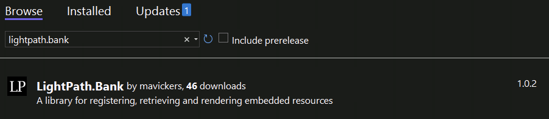

# Bank - A Library for Registering, Retrieving and Rendering Embedded Resources

Bank is a library facilitating the serving of embedded resources located in a .Net DLL. The allows web-consumable resources (such as scripts, css, or images) to be embedded in a .Net project and deployed and served from a single DLL. Think of it as a replacement for WebResource.axd and ScriptResource.axd.

The steps in the following quick start guide are implemented in a web project included in the repository named "TestApp". It is the code generated when creating a new ASP.Net project in Visual Studio, modified to demonstrate Bank functionality.

## How Do I Install It?
To use the Bank middleware the web project must first be prepped. 

### Add the Nuget Package to Your Project
Install the LightPath.Bank nuget package from the package manager console:

`c:\Projects\TestApp> install-package LightPath.Bank`

...or the Visual Studio nuget package manager:

### Wire Up the Bank Middleware 

First, add the following to web.config (if not already present) to allow the middleware to be invoked:

    <system.webServer>
      <modules runAllManagedModulesForAllRequests="true"></modules>
    </system.webServer>

For more information on this property in the web.config [consult the Microsoft documentation.](https://learn.microsoft.com/en-us/iis/configuration/system.webserver/modules/)

Now, to invoke the Bank middleware in your OWIN class add a UseBankMiddleware or MapBankMiddleware call during configuration:

    public class Owin
    {
        public void Configuration(IAppBuilder app)
        {
            app.MapBankMiddleware();
            app.UseStageMarker(PipelineStage.Authenticate);
        }
    }

For information on setting up OWIN in your project [consult the Microsoft documentation](https://learn.microsoft.com/en-us/aspnet/aspnet/overview/owin-and-katana/getting-started-with-owin-and-katana).

Wiring up the middleware is actually not necessary for consuming embedded resources registered through Bank, but it is a straightforward way of retrieving and outputting registered embedded resources in MVC views.

## How Do I Use It?

Now that the Bank middleware is wired up in the web app, resources can be registered and retrieved.

### Register Your Embedded Resources

Each embedded resource that needs to be served should be registered with Bank. The standard time of doing this is during app startup. For example, resources can be registered in global.asax.cs.

    var scriptResource = new BankEmbeddedResource
    {
        Assembly = Assembly.GetExecutingAssembly(),
        NameSpace = "Scripts",
        FileName = "HelloWorld.js",
        FacadeFileName = "GoodbyeWorld.js",
        ContentType = "application/javascript"
    };

    BankAssets.Register("hello-world-script", scriptResource);

There are two steps for registration:
* **Create an instance of BankEmbeddedResource for your resource.** The properties that need to be added are:
    * Assembly. This is the assembly where the resource is located.
    * NameSpace. This is the namespace within the assembly where the resource is located. In the example above, the resource is located in the Scripts folder which is located in the root of the project.
    * FileName. The file name of the resource in the file system. 
    * ContentType. This is the content type that will be sent as the Content-Type header in the http response. It is important that this is set to the correct value for the resource being served so the browser handles the content properly.

    Optional properties include:
    
    * FacadeFileName. In the above example the resource has the filename "HelloWorld.js", but will be served when the app receives a request for "GoodbyeWorld.js". If this value is not set, the FileName property will be used for requests for the resource.

* * **Register the resource.** This is done by calling BankAssets.Register and passing in the new BankEmbeddedResource instance. In the example above the Register method is called with an additional key name as the first parameter, but it can be called with just the embedded resource parameter. In the latter case a unique key name will be assigned to the resource in the BankAssets resource dictionary.

  The key name can be used to retrieve or reference the resource later. It is recommended to assign a friendly key name but not necessary.

### Retrieve the Registered Resources

The registered embedded resources can be retrieved directly through the API or using the included html helpers.

#### Retrieval by API

* BankAssets.GetByUrl. This method is best used in middleware processing, passing in the request path minus querystrings.
* BankAssets.GetByKey. Use this to retrieve a registered embedded resource by key name.

#### Using the HTML Helpers

In MVC view code the RenderEmbeddedResource html helper is available which will emit html markup for registered embedded resources that have the following content types:
* text/css
* text/javascript, application/javascript
* image/gif, image/jgeg, image/png, image/tiff

For example, using the embedded resource registration above the following can be added to a layouts MVC view in a web app:

    @Html.RenderEmbeddedResource("hello-world-script", true)

Assuming an assembly name of "TestApp", when the page is rendered it will create the following in the response:

     

A url path is built using the assembly name, namespace and facade filename from the registered embedded resource. When the request is received using this path, the Bank middleware intervenes, looking up the path in its registered resources and serving the content in the response.

### Additional Notes

* Notice the cache-busting querystring added to the src attribute when the html helper renders the script tag. This is an optional feature that is turned **off** by default. The RendedEmbeddedResource method call in the example above includes a **true** value for the cache-busting parameter which outputs the cache-busting querystring. The cache-busting value is regenerated each time the web app starts.
* Because this library facilitates the serving of assets that are embedded in .Net dlls, those assets are automatically cached in memory with the dll and are not continually read from the file system. The serving of these assets should be performant, but at the cost of memory usage. Beware of embedding lots of large assets (such as images).